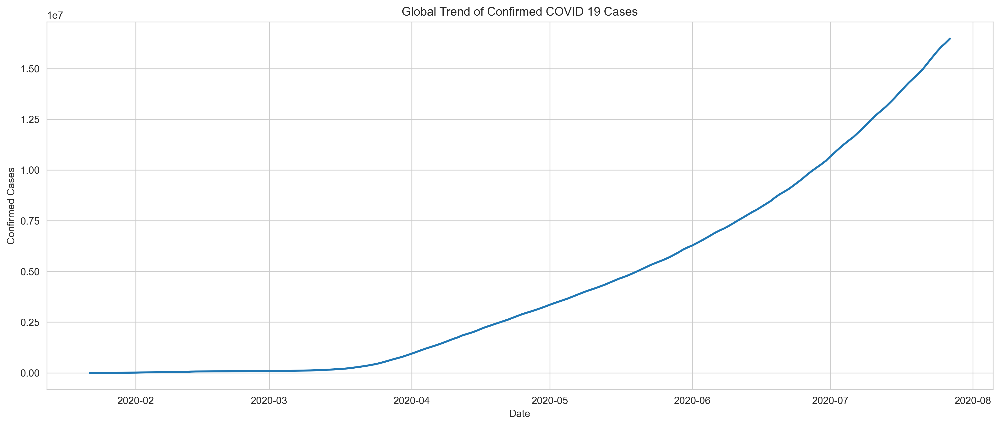
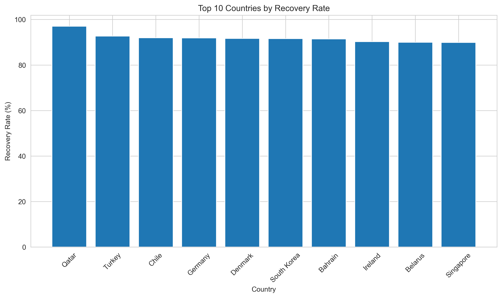
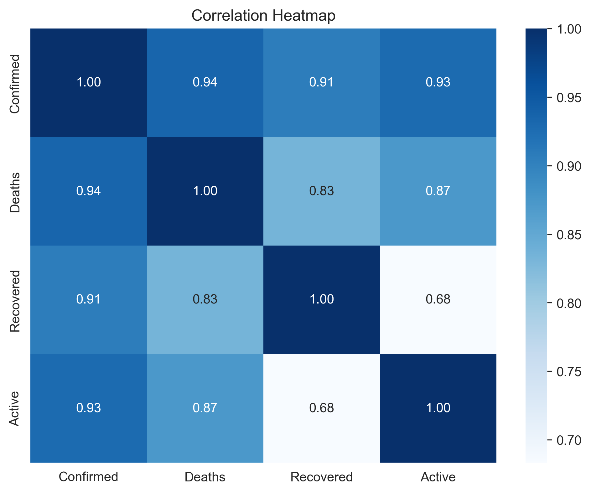

# COVID-19 Global Data Analysis

Exploratory data analysis of the global COVID-19 dataset, examining case spread, mortality, recovery, and regional patterns across countries using Python.

## Objective

Analyze the global COVID-19 dataset to identify trends, understand the spread of the virus across countries and regions, and generate insights through exploratory data analysis.

## Dataset

The dataset (`covid_19_clean_complete.csv`) contains daily cumulative COVID-19 records by country/region, including confirmed cases, deaths, recoveries, and active cases, along with WHO region classification.

## Approach

1. **Data Overview & Cleaning** — Inspected structure, data types, and missing values. Dropped the `Province/State` column (~70% missing) since the analysis focuses on country-level trends.
2. **Feature Engineering** — Extracted year, month, day, and day-of-week from the date column to enable time-based analysis.
3. **Exploratory Analysis** — Answered a series of structured questions covering case totals, deaths, recovery rates, death rates, regional comparisons, and per-capita impact.
4. **Correlation & Distribution Analysis** — Examined relationships between confirmed cases, deaths, recoveries, and active cases, and analyzed the distribution shape of confirmed cases across countries.

## Key Questions Explored

- How many countries and WHO regions are represented, and what time period does the data cover?
- Which countries reported the highest confirmed cases and deaths?
- Which countries had the highest recovery and death rates (among countries with a substantial case count)?
- How did global confirmed cases trend over time?
- Which WHO region carried the highest case burden?
- How does per-capita case/death impact compare to raw totals?
- How are confirmed cases, deaths, recoveries, and active cases correlated?

## Key Insights

- Case burden was heavily concentrated in a small number of countries (US, India, Brazil), while most countries reported comparatively low totals.
- Raw case/death counts favor large-population countries — normalizing by population changes the picture of which countries were actually hit hardest relative to their size.
- Recovery and death rates varied independently of total case volume, suggesting healthcare capacity and response timing mattered as much as case volume itself.
- WHO regions differed significantly in total case burden, reflecting disparities in population density and healthcare infrastructure.

## Visualizations

### Global Trend of Confirmed Cases

### Top 10 Countries by Cases per Million

### Correlation Heatmap

## Limitations

- Death and recovery rates are derived from a single end-of-period snapshot rather than adjusted for reporting lag, so they approximate rather than precisely measure case-fatality/recovery rates.
- Per-capita metrics use manually mapped population figures for a subset of countries; countries without a population match are excluded from those comparisons.
- Recovered-case reporting was known to be inconsistent across countries in the source data, so recovery rate comparisons should be read as directional rather than exact.

## Tools Used

- **Python** — pandas, numpy
- **Visualization** — matplotlib, seaborn
- **Environment** — Jupyter Notebook

## Files

- `COVID_19_EDA.ipynb` — Full analysis notebook
- `covid_19_clean_complete.csv` — Source dataset

## Author

**Raja Rashid**
[GitHub](https://github.com/Sofizzz18) · [LinkedIn](https://linkedin.com/in/rajarashid18)
